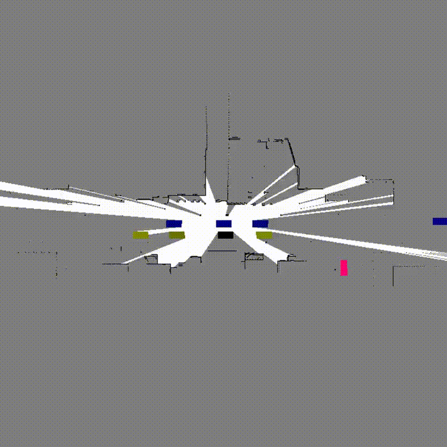

# Creating 2D dynamic occupancy grids (DOGMa) with data from the CARLA simulator

<p align="center">
  
</p>

This repository provides the tools and scripts to generate 2D Dynamic Occupancy Grids (DOGMa) from the CARLA simulator. It includes a conda environment setup, Docker configuration, data recording scripts, and a Jupyter notebook to process and visualize the results.

## High level explanation of files

- **Conda Environment & Docker Setup (`environment.yml`, `docker-compose.yml`):**  

- **Data Recording (`record_carla_sim.py`, `utils.py`):**  
  Scripts to record sensor data from the CARLA simulator based on configurations in `sensor_coords.yml` and `simulation_config.yml`.

- **Data Processing & Visualization (`create_dogmas.ipynb`):**  
  Jupyter notebook that uses the recorded data to perform ray tracing, generate occupancy/velocity maps, and produce MP4 visualizations.

## Getting Started

1. **Install CARLA:**  
   Follow this great article to [Install CARLA using Docker containers.](https://antc2lt.medium.com/carla-simulator-in-docker-in-2023-1f11f240b2df)

2. **Launch CARLA from `path/to/docker-compose.yaml`:**
   ```bash
   sudo docker-compose up
   ```

3. **Set Up a Conda Environment:**
   ```bash
   conda env create -f environment.yml
   conda activate carla_env
   ```

4. **Record Sensor Data (CARLA must be launched in another terminal):**
    ```bash
    python record_carla_sim.py
    ```
    This file creates a `./tmp/recording_DATE_TIME` directory containing point cloud and actor data, which is used to create dynamic occupancy grids.

5. **Create DOGMa:**
   
    Launch `create_dogmas.ipynb` and follow the cells step-by-step. By default, the notebook processes all recordings found in `./tmp`. Full-precision DOGMas are saved as `.npy` files in `./tmp/recording_DATE_TIME/dogma_seq_DATE_TIME`. Each DOGMa is stored as an array of shape (H, W, 3). The three channels are:

    - **Occupancy:** `{0, 0.5, 1}`
    - **Global West/East velocity:** `v_x (m/s)`
    - **Global North/South velocity:** `v_y (m/s)`


    DOGMa grid size and resolution can be modified using:
    ```bash
    radius = 75 # lidar range in meters
    cube_size = .2 # size of each voxel in meters
    ```
